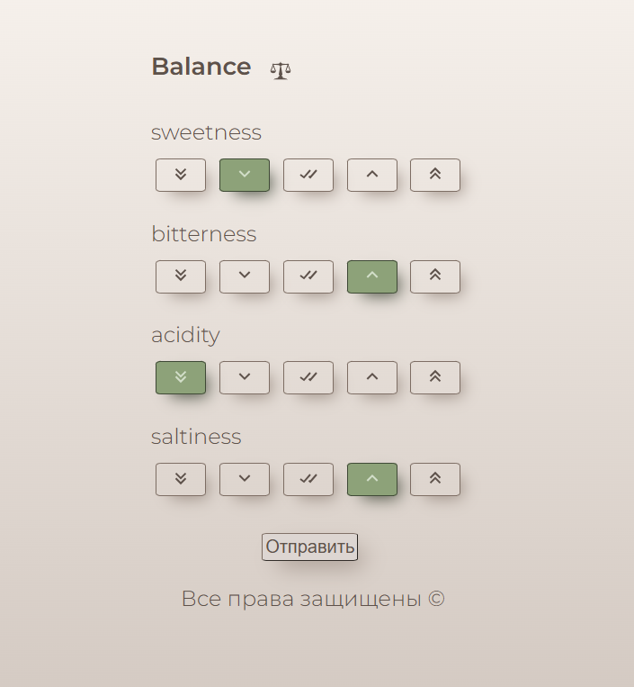

<div align="center">

# Balance Survey

**Клиентская форма опроса для проекта Balance**  
*Guest taste survey form for the Balance project*

<br/>

Веб-форма · вкусовые шкалы · адаптация рецепта

<br/>


</div>

---

## О проекте

**Balance Survey** — веб-форма для гостя в проекте [Balance](https://github.com/Shfdis/balance): короткий опрос после покупки, где можно оценить, насколько усилить или ослабить вкусовые характеристики продукта.

После заполнения backend автоматически подстраивает персональный рецепт — к следующему заказу вкус уже ближе к предпочтениям гостя.

| | |
| --- | --- |
| **Роль** | форма опроса гостя |
| **Стек** | React (CRA), JavaScript, Fetch API, CSS |
| **Backend** | [Shfdis/balance](https://github.com/Shfdis/balance) |
| **Пара** | бизнес-панель — [frontend2](https://github.com/Ariabochkina/frontend2) |

---

## Скриншот

<p align="center">
  
</p>

---

## Что делает приложение

Форма открывается по ссылке с параметрами `recipe_id` и `token`:

1. загружает список вкусовых характеристик рецепта (`GET /tastes/<recipe_id>`);
2. даёт гостю оценить каждый вкус по шкале от «сильно ослабить» до «сильно усилить»;
3. отправляет ответы на backend (`POST /submit/<token>`), после чего токен аннулируется.

---

## Как это стыкуется с backend

```text
Гость открывает ссылку
  ?recipe_id=...&token=...
        │
        ▼
┌─────────────────────────┐
│  balance-survey (форма) │
└──────────┬──────────────┘
           │ GET /tastes/<recipe_id>
           │ POST /submit/<token>
           ▼
┌─────────────────────────┐
│  balance (Flask)        │  изменяет персональный рецепт
└─────────────────────────┘
```

Формат тела `POST /submit/<token>`:

```json
{
  "sweetness": 0.05,
  "bitterness": -0.1,
  "acidity": 0
}
```

Каждый ключ — название вкуса, значение — коэффициент изменения от `-0.1` до `0.1`.

---

## Моя зона ответственности в этом проекте

- разработка UI формы опроса на React;
- декомпозиция на компоненты (`Header`, `Elements`, `Element`, `Button`);
- визуальное оформление и состояния выбора по шкале;
- интеграция с API backend (`/tastes`, `/submit`).

---

## Технологии

- React (Create React App)
- JavaScript (class components)
- Fetch API
- React Icons
- CSS (Google Fonts — Montserrat)

---

## Структура проекта

```text
src/
├── App.js                 # загрузка вкусов, сбор ответов, submit
├── index.js
├── index.css              # тема и состояния кнопок
└── components/
    ├── Header.js          # бренд Balance
    ├── Footer.js
    ├── Elements.js        # список строк опроса
    ├── Element.js         # одна вкусовая характеристика + шкала
    └── Button.js          # кнопка варианта ответа
```

---

## Шкала ответов

| UI | Значение | После `/ 20` | Смысл |
| --- | --- | --- | --- |
| ⇓⇓ | `-2` | `-0.1` | сильно ослабить |
| ⇓ | `-1` | `-0.05` | ослабить |
| ✓✓ | `0` | `0` | оставить как есть |
| ⇑ | `1` | `0.05` | усилить |
| ⇑⇑ | `2` | `0.1` | сильно усилить |

---

## Локальный запуск

Нужны Node.js и npm.

### 1) Установить зависимости

```bash
npm install --legacy-peer-deps
```

(`--legacy-peer-deps` нужен из‑за React 19 и старых testing-библиотек в CRA.)

### 2) Запустить форму

```bash
npm start
```

Откроется [http://127.0.0.1:3000](http://127.0.0.1:3000).

**Только посмотреть UI** — достаточно открыть этот адрес без параметров: форма покажет демо-вкусы, ответы при «Отправить» выведутся в alert (без backend).

**Полный сценарий с backend** — поднимите [balance](https://github.com/Shfdis/balance) (API на `http://localhost:5000`) и откройте:

```text
http://127.0.0.1:3000/?recipe_id=1&token=<token>
```

Токен выдаёт backend (`GET /usersToken` с `user_id` и `recipe_id`).  
Если API на другом адресе — поменяйте `APIUrl` в `src/App.js`.

> В монорепозитории [Shfdis/balance](https://github.com/Shfdis/balance) эта форма по-прежнему лежит в папке `frontend1` (порт `3001`) — так устроен Docker-деплой. Этот репозиторий — отдельная клиентская часть для портфолио.

---

## Ссылки

- Backend: [Shfdis/balance](https://github.com/Shfdis/balance)
- Бизнес-панель: [Ariabochkina/frontend2](https://github.com/Ariabochkina/frontend2)
- Демонстрация Balance: [Яндекс.Диск](https://disk.yandex.ru/i/mr6iN2WnrF1sFg)
